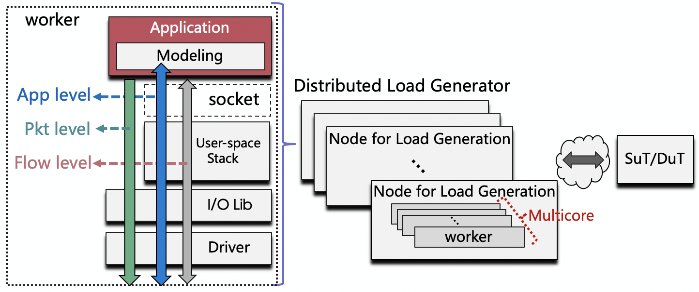

# MCC (Massive Client Connections)

### Introduction

MCC is a scalable network workload generator based on user-space stack. It can replicate flow-level network load utilizing BSD-like socket API provided by user-space TCP/IP stack (mTCP). According to experiments, MCC can generate 3.2 million concurrent TCP connections using only a single CPU core, and achieve almost linearly scalability in multicore platform and distributed systems. 


### Architecture
 
 


### Prerequisites
Intel DPDK      
cmake3      
boost-devel      
bc      
pciutils      

### Included directories

```bash
./    
|__apps/			Sample applications      
|__conf/			Sample configuration files       
|__http/			HTTP parsing files      
|__mtcp/			User-level stack      
|__scripts/			Scripts used for deployment      
|__src/				Source files    
|__tests/			Testing examples   
```

**Introduction to apps**

+ mcc_client: an app used for simulating massive concurrent tcp connections in IoT scenerio.
+ http_loader: an HTTP benchmarking tool like wrk.

### Installation

#### Downloads

```bash
$ ./install_dependencies.sh
$ git submodule init
$ git submodule update
$ cd mtcp
$ git submodule init
$ git submodule update
```
#### Setup User-level stack 

(You may reference to https://github.com/mtcp-stack/mtcp for details)

```bash
$ cd mtcp/
$ ./build-dpdk.sh
```

#### Compile
```bash
$ cd ..
$ ./build.sh
```
There is a build_type option in build.sh to designate build type of the project. And the built executable file is put in directory $PWD/build/$build_type/

#### Run

Take mcc_client for example:
```bash
$ cd build/release/apps/mcc/
$ ./mcc -c 1000000 -d 60 --smp 9 --network-stack mtcp --dest 192.168.3.6

-c [ --conn ] arg (=100)		Total connections
-d [ --duration ] arg (=0)		Duration of test in seconds
--smp arg (=1)					Number of threads (default: one per CPU)
--network-stack arg (=kernel)	Select network stack (default: kernel stack)
--dest arg (=192.168.1.1)		Destination IP
```

### Frequently asked questions

1. How can I quit the application?
Use ^C to gracefully shutdown the application. Or you can kill process with “pkill” command in Linux.

2. No connection is established successfully when using user-level stack.
You need to add static ARP entry and static route entry.

### Release Notes

**V 2.0**

Add support for distributed mode and stateless workload generation

+ Distributed
+ Stateful/Stateless

**V 1.2**

Add suport for application-level load generation

+ Encryption/decryption
+ Simulating response processing
+ Modeling for packet length and inter-departure time

**V 1.1**

Add supprt for paket-level priority

+ MCC only supports flow-level priority before, which means packets in the same flow hold the same priority for MCC v1.0. To meet more needs, we add support for packet-level priority.

**V 1.0**

Multicore scalable network load generator based on userspace stack.

+ User-level-stack-based
+ Reactor pattern
+ Multi-threaded

### Contacts

wuwenqing@ict.ac.cn   

convexcat@outlook.com

### References
> [1] Wu, Wenqing, et al. "MCC: a Predictable and Scalable Massive Client Load Generator."  International Symposium on Benchmarking, Measuring and Optimization. Springer, Cham, 2019.
